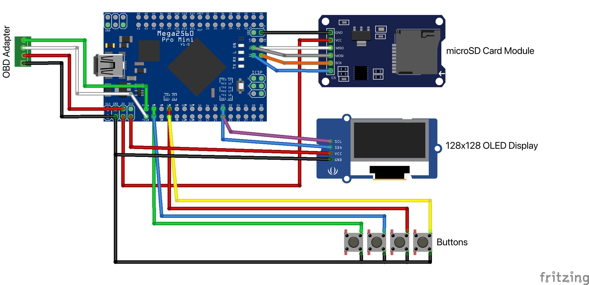

# OBDT-i2

**On-Board Diagnostics & Telemetry — Iteration 2**

> Obadiah, **o-bee** for short — *On-Board Embedded Electronic*

---

## HARDWARE:

### Microcontroller

~~**Arduino Nano R4**~~

> The Nano R4 uses a **Renesas architecture**, which differs from the original Nano used in OBDT-i1.  
> The current OBD-II hardware, libraries, and existing code were not working properly with the Renesas platform.

**Mega 2560 Pro Embed — USB-C**

- Uses the **ATmega2560** architecture.
- More compatible with the existing OBDT-i1 Arduino code and hardware.
- Provides significantly more I/O, memory, and serial interfaces than the original Nano.
- Compact embedded form factor despite being based on the Mega 2560.

### Display

**1.5" SH1107 128×128 OLED Display Module**

- Larger display than the previous version.
- 128×128 resolution.
- Requires updated display configuration/libraries compared with OBDT-i1.

### Storage

**MicroSD Card Adapter — HW-125**

- Same SD card adapter used in OBDT-i1.
- Already had several available.
- Physical size may become an issue when designing the final enclosure.

### Tools

**YIHUA 926 III Soldering Station**

- Budget soldering station.
- More than sufficient for prototyping and assembling OBDT-i2.

---

## WIRING:



### OLED Display

| OLED Pin | Mega 2560 Pro Embed |
|---|---|
| SDA | D20 |
| SCL | D21 |
| VCC | 3.3V |
| GND | GND |

### OBD Adapter

| Adapter Wire | Mega 2560 Pro Embed |
|---|---|
| Green TX | RX0 |
| White RX | TX1 |
| Red VCC | 5V |
| Black GND | GND |

### MicroSD Adapter

| MicroSD Pin | Mega 2560 Pro Embed |
|---|---|
| MISO | D50 |
| MOSI | D51 |
| SCK | D52 |
| CS | D53 |
| VCC | 5V |
| GND | GND |

### Buttons

| Button | Function | Mega 2560 Pro Embed |
|---|---|---|
| Green | Previous / Left | D2 |
| Blue | Next / Right | D3 |
| Red | Select / Confirm | D6 |
| Yellow | Back / Exit | D7 |

Connect the other terminal of each button to GND.
---

## Arduino IDE Configuration

**Board**

```text
Arduino Mega or Mega 2560
```

## Development Log

### 9/17/26

- Soldered new board
- Configed screen
- Made program selector
- Added images

### 9/18/26

- Wiring diagram
- Both i1 and i2 are not working

### 9/19/26

- Repeated failed tests.
- Mark 1 doesn't seem to be working either now.
- I need to see if this is an issue of vehicle, since it was before. 
